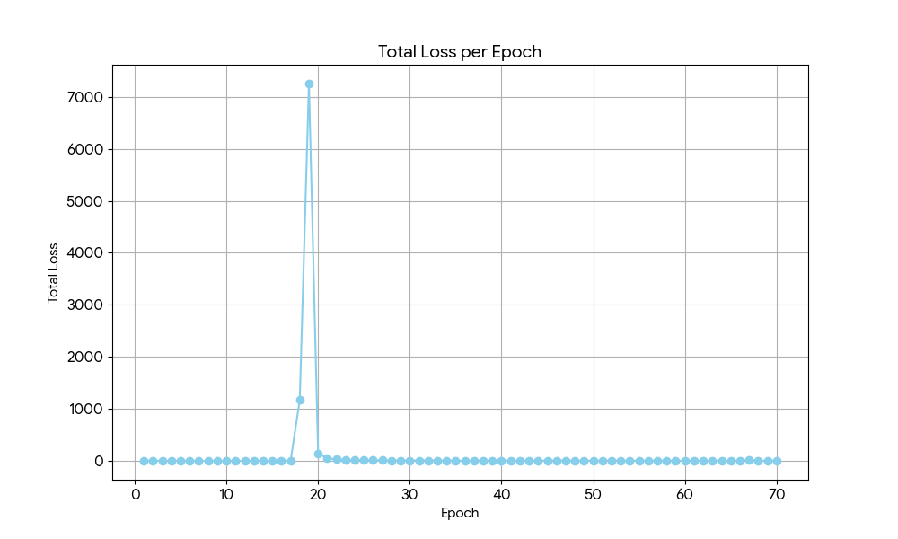

## This is an experiment on LLMs, based on recent findings from mechanistic Interpretability

*Btw, this code is a continuition of my SimpleLLM repo,*

- So based on a recent video I saw, LLMs need deep layers to make complex circuits and get complex understandings,
so for that we need large number of the LLM-Blocks, so how about this, what if could make a specific layer or a new kind of block to model what the other layers do, basically said,

- if we actually had,

*embeddings -> block1 -> block2 -> block3 -> block4 -> block5 -> block6 -> ................... blockN -> lmhead*

- what if could do,

*embeddings -> block1 -> block2 -> block3 -> block4 -> SpecialBlock -> blockN*

- thus replacing the computation of blocks from 5 to N-1 with SpecialBlock,

- Where Special Block can be a recurrent transformer model or someother model which does computation (N-1 -> 6) => (7*N) times to model deep representations.

- This is a work in progress, so please feel free to contribute or suggest improvements.

# 🔍 What to Look For
- So here’s the deal —
- This whole experiment is aimed at testing whether a single smart block can simulate what deeper transformer layers do. That’s the core idea.

# 📉 Loss Plot Insight
- Check out the loss plot (loss_plot.html) to see where things start to explode — that's where the current implementation hits a limitation. It gives you a sense of where the modeling struggles when trying to compress multi-layer behavior into one block.

- The exploding loss is expected — remember this is research-in-progress, and it's about pushing limits, not just playing safe.

- 📓 For Generations & Outputs
To see actual generations and tests, scroll down to the SLM.ipynb notebook.
That's where I’ve played around with sampling, and how this block behaves inside the usual transformer architecture.


**So main the higlight of this experiment is to see if we can replace the computation of multiple blocks with a single block that can model the deep representations of the previous blocks, so for that I made this SpecialTimedDecoderBlock with a trick on using nn.Embedding to keep track of the time steps**

```
class SpecialTimedDecoderBlock(nn.Module):

    def __init__(self, timesteps, num_heads, context_length, embed_size, device='cpu'):
      
      super().__init__()

      self.device = device
      self.embeddings = nn.Embedding(num_embeddings=timesteps, embedding_dim=embed_size) # Did u know that u could use embeddings as a clock signal
      self.LLMBlock = TLMBlock(num_heads, context_length, embed_size)
      #self.timer = torch.tensor([0]).to(device=device)
      #self.timer.requires_grad_(False)

      self.time_steps = timesteps

    def forward(self, current_embs):
      timer_embs = self.embeddings(torch.arange(self.time_steps, device=self.device))
      
      x = current_embs
      for i in range(self.time_steps):
          x = x + timer_embs[i].unsqueeze(0)  # Assuming batch dimension
          x = self.LLMBlock(x)
      return x
```
